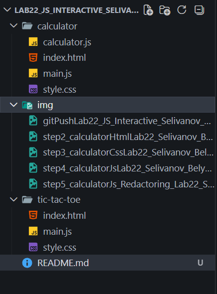

# Описание проекта

Проект представляет собой простой калькулятор, который работает прямо в браузере. Он позволяет выполнять базовые математические операции и показывает результат на экране. Интерфейс состоит из поля вывода и набора кнопок, которые пользователь нажимает для ввода выражения.

# Функциональность

## Поддерживаемые операции

- сложение
- вычитание
- умножение
- деление
- ввод точки
- очистка выражения
- вычисление результата

## Ограничения

- нельзя вводить два оператора подряд
- нельзя ставить две точки в одном числе
- выражение не может начинаться с оператора, кроме минуса
- выражение не может заканчиваться оператором

## Обработка ошибок

- если выражение неправильное — выводится «Ошибка»
- если деление на ноль — тоже «Ошибка»
- после ошибки калькулятор очищает выражение и ждёт нового ввода

# Архитектура

## Структура файлов

## Класс Calculator

Класс отвечает за всю работу калькулятора.  
В нём есть:

- поле для хранения текущего выражения
- метод для обработки нажатий кнопок
- метод для добавления символов
- метод для вычисления результата
- метод для проверки правильности выражения
- метод для очистки
- метод для обновления дисплея

Класс берёт на себя всю логику, чтобы код был лучше.

## Взаимодействие компонентов

- HTML создаёт кнопки и поле вывода
- CSS отвечает за внешний вид
- JavaScript ловит нажатия кнопок
- класс Calculator решает, что делать с каждым нажатием
- результат выводится на экран

# Логика работы

## Что происходит при нажатии кнопки

1. Пользователь нажимает кнопку
2. JavaScript получает текст кнопки
3. Calculator определяет, что это: цифра, оператор, точка, «=» или «C»
4. В зависимости от этого обновляется выражение или запускается вычисление
5. Дисплей обновляется

## Как работает проверка ввода

- проверяется, что нет двух операторов подряд
- проверяется, что точка не повторяется
- проверяется, что выражение не начинается с оператора
- проверяется, что выражение не заканчивается оператором

Если ввод неправильный — символ просто не добавляется.

## Как происходит вычисление

- перед вычислением выражение проверяется
- если всё нормально — вызывается `eval()`
- результат выводится на экран
- если ошибка — выводится «Ошибка» и выражение очищается

# Лабораторная работа №23 — Крестики‑нолики

## Описание игры

Игра «Крестики‑нолики» представляет собой поле 3×3, на котором два игрока по очереди ставят свои символы — X и O. Первый игрок всегда начинает с X. Цель игры — собрать три одинаковых символа подряд: по горизонтали, вертикали или диагонали. Если все клетки заполнены и победителя нет, игра заканчивается ничьёй.

В проекте реализовано:

- отображение игрового поля;
- обработка кликов по клеткам;
- определение победы или ничьи;
- переключение хода между игроками;
- кнопка «Начать заново» для перезапуска игры.

## Игровая механика

### Определение победителя

После каждого хода проверяются все возможные выигрышные комбинации.  
Если три клетки из одной комбинации содержат одинаковый символ, игра завершается и выводится сообщение о победителе.

### Обработка кликов

Каждая клетка имеет свой индекс. Когда игрок нажимает на клетку:

- проверяется, свободна ли она;
- в массив `board` записывается символ текущего игрока;
- клетка получает этот символ на экране;
- запускается проверка победы или ничьи;
- если игра продолжается, ход передаётся другому игроку.

### Перезапуск игры

Кнопка «Начать заново»:

- очищает массив `board`;
- очищает все клетки на поле;
- сбрасывает текущего игрока на X;
- включает игру снова.

## Структура данных

### Массив `board`

`["", "", "", "", "", "", "", "", ""]`

Каждый элемент — это клетка игрового поля.  
Пустая строка означает, что клетка свободна.

### Условия победы

Список выигрышных комбинаций хранится в массиве `winConditions`.  
В нём 8 вариантов:

- 3 горизонтали
- 3 вертикали
- 2 диагонали

Каждая комбинация — это три индекса клеток, которые должны совпасть.

### Хранение состояния игры

- `board` — текущее состояние поля
- `currentPlayer` — X или O
- `gameActive` — идёт игра или уже закончилась

## Алгоритмы

### Проверка победы

1. Перебрать все выигрышные комбинации.
2. Проверить, что три клетки не пустые и равны друг другу.
3. Если да — победа.

### Определение ничьи

Если в массиве `board` нет пустых клеток и победителя нет — ничья.

### Смена игрока

Если игра продолжается:

- X → O
- O → X

Статус на экране обновляется после каждого хода.
